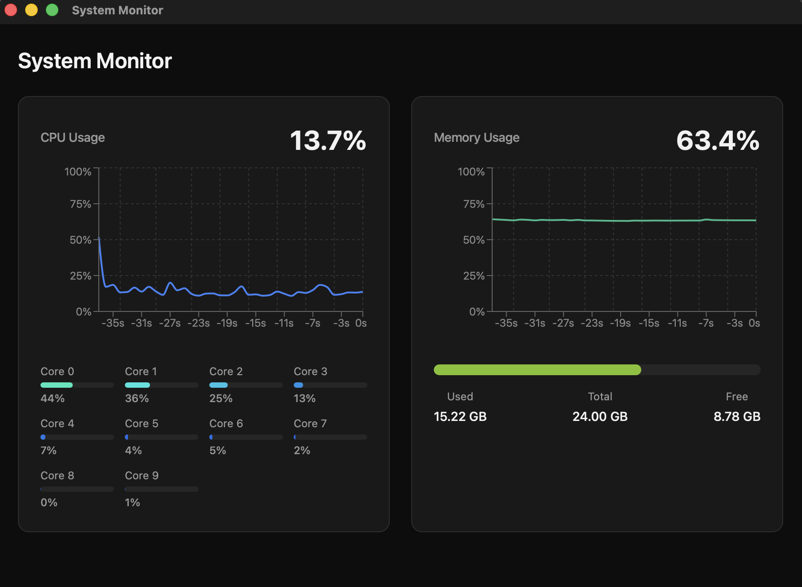
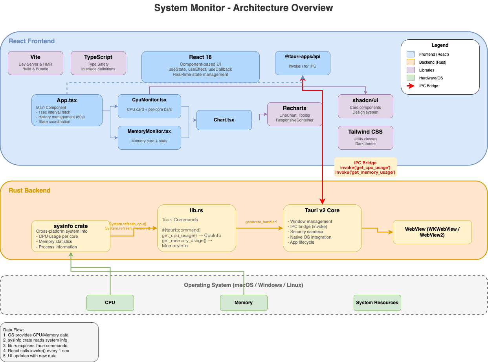

# System Monitor

Tauri、React、Rustで構築された、CPUとメモリ使用率をリアルタイムで監視する軽量デスクトップアプリケーション。

[English README](./README.md)



## 機能

- **リアルタイムCPU監視**
  - 全体のCPU使用率
  - コア別使用率（プログレスバー表示）
  - 負荷に応じた色分け表示（青〜赤）

- **リアルタイムメモリ監視**
  - メモリ使用率
  - 使用量 / 総容量 / 空き容量の表示
  - 動的な色変化付きプログレスバー

- **履歴データの可視化**
  - 直近60秒分のデータを折れ線グラフで表示
  - スムーズなアニメーションとレスポンシブデザイン
  - 1秒間隔で更新

- **モダンなUI**
  - システム監視に最適化されたダークテーマ
  - shadcn/uiコンポーネントを使用
  - レスポンシブグリッドレイアウト

## スクリーンショット

アプリケーションは2つのメインカードを表示します：

- **CPU使用率カード**: 全体使用率、履歴グラフ、コア別内訳
- **メモリ使用率カード**: 使用率、履歴グラフ、詳細なメモリ統計

## 技術スタック

### フロントエンド

- **React 18** - UIフレームワーク
- **TypeScript** - 型安全性
- **Vite** - ビルドツール・開発サーバー
- **Tailwind CSS** - ユーティリティファーストCSSフレームワーク
- **shadcn/ui** - UIコンポーネントライブラリ
- **Recharts** - データ可視化用チャートライブラリ

### バックエンド

- **Rust** - システムプログラミング言語
- **Tauri v2** - デスクトップアプリケーションフレームワーク
- **sysinfo** - クロスプラットフォームシステム情報ライブラリ

### アーキテクチャ図



## 前提条件

- [Node.js](https://nodejs.org/) (v18以降)
- [Rust](https://www.rust-lang.org/tools/install) (最新の安定版)
- Tauriのプラットフォーム固有の依存関係：
  - **macOS**: Xcode Command Line Tools
  - **Windows**: Microsoft Visual Studio C++ Build Tools
  - **Linux**: [Tauriの前提条件](https://tauri.app/v1/guides/getting-started/prerequisites/#setting-up-linux)を参照

## インストール

1. リポジトリをクローン：

   ```bash
   git clone <repository-url>
   cd system-monitor
   ```

2. 依存関係をインストール：
   ```bash
   npm install
   ```

## 開発

ホットリロード付きの開発サーバーを起動：

```bash
npm run tauri dev
```

これにより以下が実行されます：

- フロントエンド用のVite開発サーバーの起動
- Rustバックエンドのコンパイル
- アプリケーションウィンドウの起動

## ビルド

本番用ビルドを作成：

```bash
npm run tauri build
```

ビルドされたアプリケーションは以下に出力されます：

- **macOS**: `src-tauri/target/release/bundle/dmg/`
- **Windows**: `src-tauri/target/release/bundle/msi/`
- **Linux**: `src-tauri/target/release/bundle/deb/` または `appimage/`

## プロジェクト構成

```
system-monitor/
├── src/                          # Reactフロントエンド
│   ├── App.tsx                   # メインアプリケーションコンポーネント
│   ├── main.tsx                  # エントリーポイント
│   ├── index.css                 # グローバルスタイル・Tailwind設定
│   ├── components/
│   │   ├── Chart.tsx             # Recharts折れ線グラフラッパー
│   │   ├── CpuMonitor.tsx        # CPU監視カード
│   │   ├── MemoryMonitor.tsx     # メモリ監視カード
│   │   └── ui/
│   │       └── card.tsx          # shadcn/ui Cardコンポーネント
│   └── lib/
│       └── utils.ts              # ユーティリティ関数（cnヘルパー）
├── src-tauri/                    # Rustバックエンド
│   ├── src/
│   │   ├── main.rs               # アプリケーションエントリーポイント
│   │   └── lib.rs                # Tauriコマンド・システム情報ロジック
│   ├── Cargo.toml                # Rust依存関係
│   └── tauri.conf.json           # Tauri設定
├── components.json               # shadcn/ui設定
├── tailwind.config.js            # Tailwind CSS設定
├── vite.config.ts                # Vite設定
├── tsconfig.json                 # TypeScript設定
└── package.json                  # Node.js依存関係
```

## APIリファレンス

### Tauriコマンド

#### `get_cpu_usage`

現在のCPU使用率情報を返します。

**レスポンス：**

```typescript
interface CpuInfo {
  overall: number; // 全体のCPU使用率 (0-100)
  per_core: number[]; // コア別使用率の配列 (各0-100)
}
```

#### `get_memory_usage`

現在のメモリ使用率情報を返します。

**レスポンス：**

```typescript
interface MemoryInfo {
  used: number; // 使用中メモリ（バイト）
  total: number; // 総メモリ（バイト）
  percentage: number; // 使用率 (0-100)
}
```

## 設定

### ウィンドウ設定

`src-tauri/tauri.conf.json`を編集してカスタマイズ：

```json
{
  "app": {
    "windows": [
      {
        "title": "System Monitor",
        "width": 900,
        "height": 700,
        "minWidth": 600,
        "minHeight": 500
      }
    ]
  }
}
```

### 更新間隔

`src/App.tsx`で間隔を変更：

```typescript
const interval = setInterval(fetchData, 1000); // 1000を希望のミリ秒に変更
```

### 履歴の長さ

チャートに表示するデータポイント数を調整：

```typescript
const HISTORY_LENGTH = 60; // 表示する秒数
```

## 推奨IDE設定

- [VS Code](https://code.visualstudio.com/)
- [Tauri拡張機能](https://marketplace.visualstudio.com/items?itemName=tauri-apps.tauri-vscode)
- [rust-analyzer](https://marketplace.visualstudio.com/items?itemName=rust-lang.rust-analyzer)
- [Tailwind CSS IntelliSense](https://marketplace.visualstudio.com/items?itemName=bradlc.vscode-tailwindcss)

## ライセンス

MIT License
